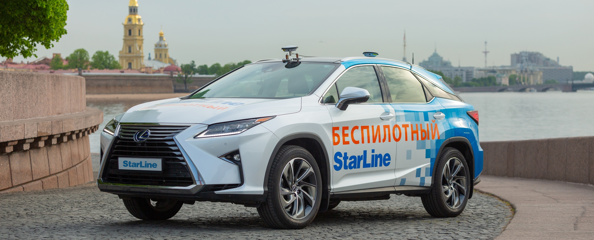

# OSCAR, StarLine Open-Source CAR

Беспилотный автомобиль StarLine -- это программно-аппаратная платформа для создания беспилотного автомобиля [4 уровня автономности](https://en.wikipedia.org/wiki/Autonomous_car#Levels_of_driving_automation). OSCAR является open-source проектом, поэтому сторонние разработчики и энтузиасты могут принять в нем участие.

Проект OSCAR создан на базе проекта [apollo.auto](https://apollo.auto) от [Baidu](https://www.baidu.com/)

## Документация

[Иснтрукция по установке и сборке проекта OSCAR](docs/oscar/README.md)

[Описание программно-аппаратной платформы проекта OSCAR](docs/oscar/soft_hard_description.md)

[Работа с симулятором](docs/oscar/lgsvl_simulator.md)

## Сообщество

В рамках проекта oscar ежегодно проводится **Хакатон Беспилотный автомобиль StarLine**, где участникам предоставлятся возможность разработать и представить решения передовых задач, стоящих перед исследователями в области автономного транспорта и искусственного интеллекта России и мира. Больше подробностей о регламенте можно найти на [оффициальной странице хакатона](https://robofinist.ru/event/info/short/id/339).

Для активных студентов и амбициозных специалистов из Open Source Community у нас имеется [список актуальных для проекта задач](docs/oscar/task_for_students.md). Если вы ищете возможности обратить на себя внимания, это то, с чего можно начать.

## Контакты

С нами можно связаться по почте **smartcar@starline.ru**.

А еще у нас есть [Twitter](https://twitter.com/starline_oscar) и [YouTube](https://www.youtube.com/channel/UC1ZPtOXu7cr4HsQKRpElDnA).
