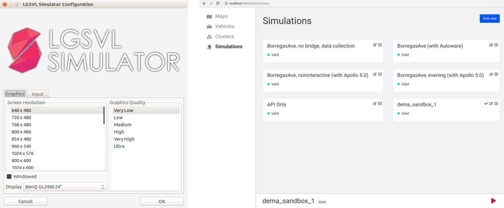
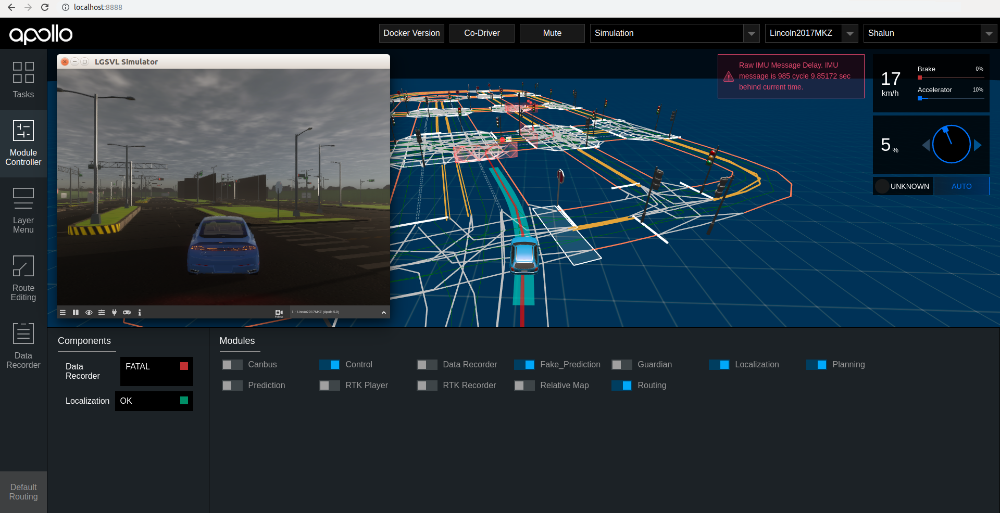

В качестве основного симулятора в рамках проекта OSCAR используется [LGSVL](https://www.lgsvlsimulator.com).

### Установка

1. Скачайте и распакуйте последний релиз (не *-rc* версию) lgsvl с [оффициального репозитория на github](https://github.com/lgsvl/simulator/releases).

2. Для запуска симулятора перейдите в соответствующую директорию и выполните

    ```
    ./simulator
    ```

    В появившемся окне конфигурации требуется выбрать разрешение экрана и качество выходного изображения. Не рекомендуется ставить максимальные настройки в связи с требовательностью симулятора к ресурсам.

    После нажатия OK появится окно симулятора, в котором будет одна кнопка "Open Browser...", ее и нужно нажать. В браузере должна открыться вкладка с настройками симуляции. Слева будут 4 вкладки - Maps, Vehicles, Clusters, Simulations.


3. Настройте и запустите симуляцию

    Перейдите во вкладку **Simulations** и создайте симуляцию нажатием на **Add new**. В появившемся окне назовите симуляцию любым именем, затем перейдите во вкладку **Map & Vehicles**, выберите любую карту и любой автомобиль с поддержкой Apollo 5.0, в поле **Bridge connection string** напротив автомобиля введите 127.0.0.1:9090, убедитесь, что галка **Run simulation in interactive mode** включена и завершайте создание симуляции кнопкой **Submit**.

    Во вкладке **Simulations** появится созданная вами симуляция. Выбирете ее и запускайте используя появившуюся в нижней части окна кнопку *Play*.

    В основном окне симулятора появится созданная вами симуляция, да ее запуска требуется нажать кнопку *Play* в нижнем левом углу.

    


5. Войдите в контейнер apollo, запустите bootstrap и мост

    ```
    ./scripts/bootstrap.sh
    ./scripts/bridge.sh
    ```


6. Запустите стек Apollo для управления автомобилем в симуляции

    Откройте Dreamview введя в браузере localhost:8888 и выберите используемую вами в симуляции карту и автомобиль. Выберете мод **Simulation** и перейдите в панель **Module Controller**. Запустите модули *Planning*, *Localization*, *Routing*, *Control*, *Perception* и *Prediction*. На момент написания этого документа со стороны Apollo существует ограничение на используемую видеокарту(nvidia GeForce GTX 1060), в случае, если у вас нет такой видеокарты, то вы можете не запускать модуль *Perception*, а вместо модуля *Prediction* использовать *Fake_Prediction*.

    Перейдите в панель **Route Editing** и назначте цель маршрута. Если автомобиль в симуляции начал движение, то подготовку к работе с симулятором можно считать оконченной.

    


7. Добавление новых карт и автомобилей

    В симулятор можно добавлять новые карты, для этого нужно в соответствующей вкладке **Maps** нажать кнопку **Add new**, в появившемся окне ввести имя новой карты и дать ссылку на Asset карты. Ссылки на карты, которые предлагает LG, можно взять здесь: https://content.lgsvlsimulator.com/maps/. После выбора карты на сайте будут две опции для скачивания - Asset Bundle - собранный вариант окружения для Unity, если скопировать эту ссылку и вставить в Add new, то в симуляторе станет доступна новая карта, и HD карта для Apollo/OpenDrive/LaneNet2.

    Аналогично с автомобилями, которые можно взять отсюда: https://content.lgsvlsimulator.com/vehicles/.

    Также LG предоставляет простую настройку сенсоров автомобиля по нажатию на гаечный ключ в правом верхнем углу иконки каждого автомобиля. В Bridge Type нужно выбрать CyberRT для соединения с Apollo, в Sensors должна быть JSON конфигурация сенсоров. За подробной информацией по этому и другим темам следует [обращаться к оффициальной документации симулятора](https://www.lgsvlsimulator.com/docs/sensor-json-options/).

    Важно: при настройке transform нужно учитывать, что точка отсчета в симуляторе находится под машиной посередине.


### Устранение возможных проблем

1. Мирцание экрана или быстрое непроизвольное переключение между основной камерой пользователя и камерой в составе автомобиля.

    [Баг описан в Issues оффициального репозитория lgsvl](https://github.com/lgsvl/simulator/issues/445), как временное решение можно понизить разрешение и качество отображения до минимально возможных.
