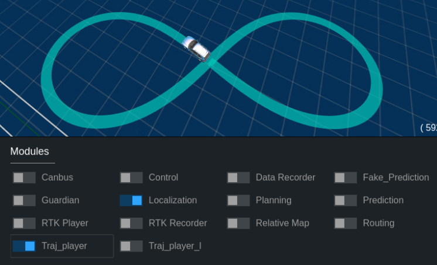

*oscar_tools* - набор утилит, позволяющий упростить навигацию по проекту и реализующий интерфейс к разрабатываему в рамках проекта ПО.

Со списком всех доступных команд можно ознакомиться, вызвав:

```
oscar help
```

Для быстрого набора для всех команд и их возможных параметров работает автодополнение.


### Использование вне контейнера

Вне контейнера *oscar_tools* позволяет упростить работу с контейнером, предоставляя следующие команды:

```
oscar docker start  - запуск контейнеров Apollo
oscar docker into   - открытие bash в контейнере с Apollo
oscar docker stop   - остановка контейнеров Apollo
oscarcd             - переход в корневую дирректорию Oscar
```

Для использования *oscar_tools* вне контейнера задайте соответствующие переменные окружения:

```
echo "source path-to-oscar-root/scripts/oscar/oscar_tools/setup.sh" >> ~/.bashrc
source ~/.bashrc
```


### Использование внутри контейнера

Внутри контейнера *oscar_tools* упростить и ускорить доступ к различным утилитам, как штатным, так и разрабатываемым в рамках проекта OSCAR, при этом скрыв для пользователя различия в реализации и интерфейсе. На данный момент доступны следующие модули:

* **trajectory**  - Набор утилит для генерации, исполнения и визуализации отладочных траекторий.
* **teleop**      - (на этапе разработки)
* **calibration** - утилиты для настройки контроллеров и калибровки сенсорики (на этапе разработки)

### Модуль генерации, исполнения и визуализации отладочных траекторий

Используя генератор отладочных траекторий можно генерировать простые траектории с заданными параметрами и использовать их для отладки алгоритмов управления автомобилем.

```
oscar trajectory generate - генерация траектории
oscar trajectory play     - исполнение траектории
oscar trajectory stop     - отмена исполнения траектории
oscar trajectory plot     - визуализация прохождения траектории
```

Конечный вид генерируемой траектории зависит от задаваемых параметров. В данный момент доступны два типа траекторий: **8type** и **0type** - восьмерка и овал соответственно. Оба типа имеют следующий набор параметров:

```
-r - минимальный радиус поворота, на который выйдет автомобиль при исполнении траектории
-v - желаемая максимальная скорость движения вдоль траектории
-a - ускорение автомобиля вдоль траектории до достижения желаемой максимальной скорости
-d - замедление автомобиля вдоль траектории для остановки в конечной точке.
-n - название файла с траекторией (не обязательный параметр)
```

Для генерации траектории, совемстимой с штатным *rtk_player* можно воспользоваться специальным флажком:

```
--rtk_player - файл с траекторией будет сохранен в подходящем для rtk_player виде и месте
```

Пример использования:

```
oscar trajectory generate 8type -r 5 -v 4 -a 0.4 -d 0.7 --rtk_player
```

Вид генерируемой таким образом траектории представлен на рисунке ниже.


Для исполнения отладочных траекторий доступен следующий набор параметров:

```
-l - выставляя этот флаг исполнение траектории будет происходить циклично
-r - желаемая частота публикации траектории в канал planning [гц]
-n - название файла с траекторией (не обязательный параметр)
```

Для исполнения траектории, записанной с штатным *rtk_recorder* можно воспользоваться специальным флажком:

```
--rtk-recorder - для исполнения будет взята траектория, записанная штатным rtk_recorder
```

Флаг *-l* или *--loop* позволяет исполнять траекторию циклично - по достижении конечной точки траектории автомобилем в качестве новой целевой точки будет выставляться начальная точка траектории. В обратном случае исполнение траектории прекращается.

Для удобства использования в dreamview доступны соответствующие кнопки управления воспроизведением:




Для визуализации исполняемой траектории доступен следующий набор параметров:

```
--rate                - желаемая частота обновления графиков [гц]
--car-path            - позволяет отображать проходимый автомобилем путь в соответствии с топиком localization
--traj-frames         - позволяет отображать на исполняемой траектории целевые системы координат
--traj-car-footprints - позволяет отображать на исполняемой траектории целевые состояния автомобиля
-n                    - название файла с траекторией (не обязательный параметр)
```

[Пример использования модуля для работы с отладочными траекториями](https://youtu.be/9XCLKZ7Pb8s?t=350)
