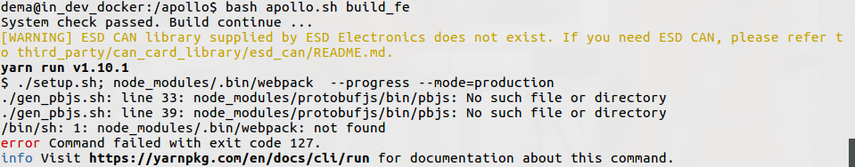
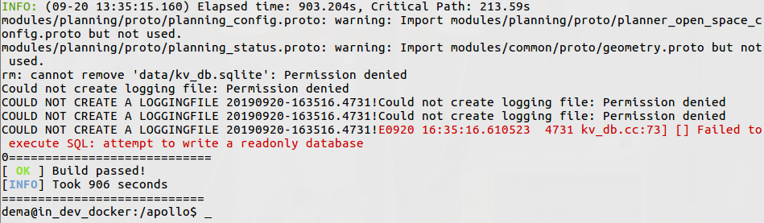
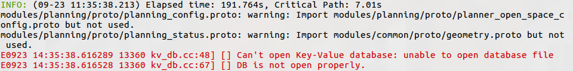

Ввиду различных неопределенностей при установке и сборке различного ПО могут возникать ошибки и сложности, данная страничка будет содержать различные такие сложности и способы их решения.

### Сборка ПО

1. Ошибка при первой сборке dreamview штатной командой:
    ```
    bash apollo.sh build_fe
    ```
    В терминале ошибка выглядит следующим образом:
    

    Решается сборкой с предварительной установкой зависимостей:
    ```
    bash apollo.sh build_fe_with_deps
    ```
    или явно:
    ```
    cd modules/dreamview/frontend
    yarn install && yarn build
    ```
2. При первой сборке проекта сборка прерывается с ошибкой доступа к директории data/log и файлу data/kv_db.sqlite:

    

    Лечится выдачей соответствующих прав и сменой владельца на текущего пользователя.

    Или же файл data/kv_db.sqlite отсутствует вовсе:

    

    Достаточно странная ошибка, так как при каждой сборке данный файл удаляется и генерируется автоматически заного.
    Лечиться подложкой копии из любого другого источника. Возможно можно разрешить другим нормальным путем.
