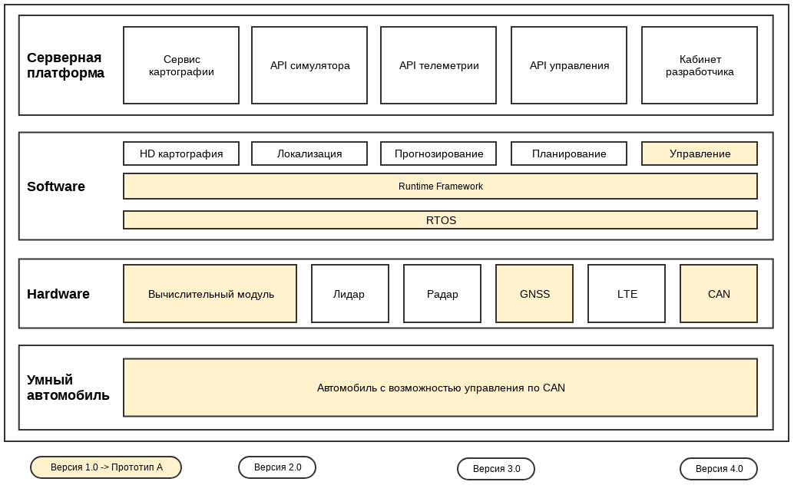
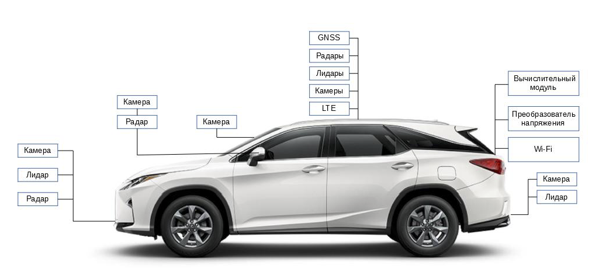
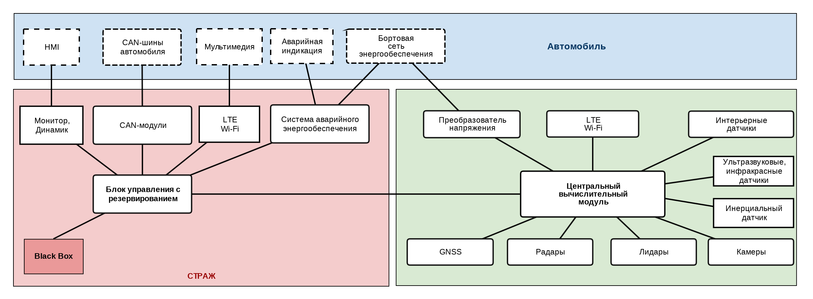
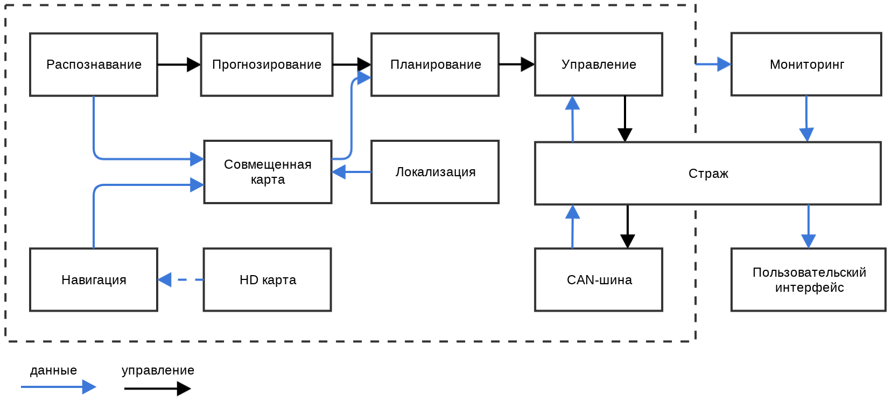
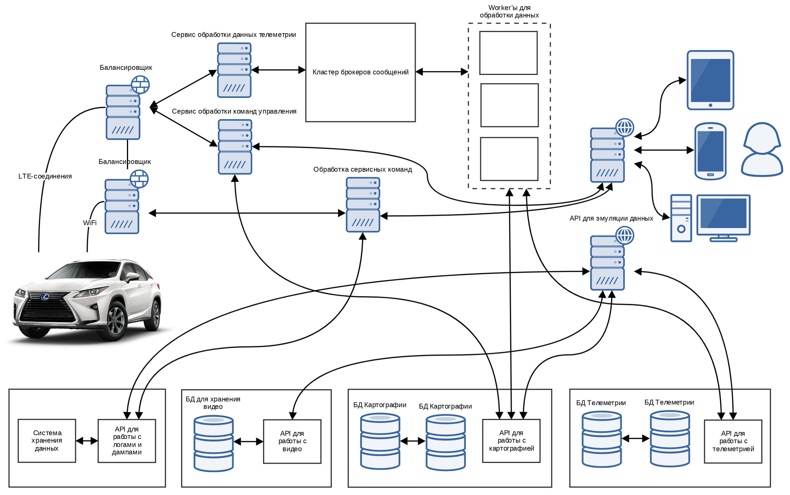

## Архитектура платформы

## Умный автомобиль

Оборудование OSCAR:
* **Радары**, которые необходимы для обнаружения препятствий. Сигнал радара служит отправной точкой для торможения или распознавания объекта камерами и лидаром.
* **Лидары**, которые нужны для определения положения автомобиля в пространстве и распознавания типов препятствий.
* **Приемник RTK GNSS**, обеспечивающий сантиметровую точность позиционирования автомобиля по спутникам GPS+ГЛОНАСС и поправкам наземных станций.
* **Стереокамера**, определяющая тип объекта и расстояние до него.
* **Монокамера**, определяющая препятствия в ближней зоне автомобиля и распознающая дорожную разметку, знаки, сигналы светофора.
* **Инерциальный датчик**, позволяющий определить положение и направление движения в случаях, когда информация от спутников GPS+ГЛОНАСС недоступна -- например, в подземном паркинге или под мостом.

### Аппаратная архитектура:

### Программные модули OSCAR:

* **Распознавание**: модуль распознавания воспринимает мир, окружающий автономный автомобиль. Содержит два подмодуля: первый отвечает за обнаружение препятствий, а второй за обнаружение и распознавание сигналов светофоров.
* **Прогнозирование**: рассчитывает будущие траектории движения распознаваемых препятствий.
* **Планирование**: планирует траекторию транспортного средства во времени и пространстве.
* **Управление**: контролирует следование по запланированной траектории путем создания управляющих команд, таких как газ, тормоз, управление рулем.
* **Навигация**: составляет план поездки из стартовой точки до места назначения.
* **CAN-шина**: интерфейс передачи конманд управления к оборудованию автомобиля.
* **HD карта**: модуль высокоточной картографии.
* **Локализация**: использует различные источники информации о положении автомобиля (GPS, лидары, радары) для определения местоположения автомобиля.
* **Совмещенная карта** -- узел между HD-картой и распознаванием, генерирует real-time карту в координатной системе автомобиля.
* **Мониторинг** -- система, наблюдающая состояние всех модулей в автомобиле, включая аппаратное обеспечение.
* **Страж** -- модуль безопасности, который включается, если монитор обнаруживает сбой.
* **Пользовательский интерфейс** -- модуль для просмотра состояния транспортного средства и управления им в режиме реального времени.

## Серверная архитектура

* **Каналы связи**:  беспилотный автомобиль будет иметь по крайней мере 2 канала связи LTE, по которым будут передаваться различные данные в режиме реального времени на серверную платформу StarLine.  Также умный автомобиль имеет возможность подключения по WiFi для выгрузки логов, дампов и выполнения сервисных работ.

  * **Канал телеметрии (LTE)**: передача в режиме реального времени на сервер данных о состоянии авто и показаний датчиков: координаты местоположения авто, показания датчиков, видео-поток с камер, состояние авто, данные о водителе, данные, передаваемые в шине CAN, логи и события.

  * **Канал оперативного управления (LTE)**: передача высокоприоритетных данных, требующих быстрого времени отклика от автомобиля, а именно, управяющие команды пользователя (начать движение по машруту, парковка и т.д.), получеие данных маршрута и картографических данных перед поездкой (или во время поездки), получение информации о дорожной обстановке и погодных условиях.

  * **Сервисный канал (WiFi)**: "толстый" канал, доступный в гараже для выгрузки/загрузки большого объема данных: видео с камер за время поездки, sensor-fusion данные за время поездки, сырые данные с датчиков за время поездки, логи и dump данных для анализа, выполнение команд по обновлению ПО и обновлению карт.

* **Балансировщик**: обрабатывает подключения от устройства. Отвечает за масштабирование и отказоустойчивость. Распределяет данные по одному или нескольким сервисам обработки данных. Балансировка осуществляется с помощью NGINX.

* **Протокол передачи данных**: бинарный протокол передачи данных на основе protobuf.

* **Сервис обработки данных телеметрии**: высоконагруженный сервис на C++ для приема и обработки данных телеметрии устройства и отправки данных в кластер менеждера обработки сообщений.

* **Сервис обработки команд управления**: сервис на C++ для обслуживания команд управления.

* **Кластер менеджера сообщений**: отказоустойчивый кластер менеджера сообщений на базе RabbitMQ.

* **Сервисы для обработки данных телеметрии**: обработка данных телеметрии и хранение данных в БД.

* **REST API для подключения клиентов**: API на базе OpenApi и фреймворка tornado.

* **API платформы симулятора**: API для работы с симулятором и данными для него

* **API для работы с логами и dump-данными**: высокоуровневое API для работы с логами.

* **Система хранения Dump-данных**: система хранения данных.

* **API для работы с картографией**: высокоуровневое API для для работы с картографией. API агрегирует данные, полученные от провайдеров картографических данных и данные картографии, полученные от автомобиля при анализе дынных датчиков. Пример задач, выполняемых API:
  * геокодирование
  * обратное геокодирвоание
  * получение маршрута по начальной и конечной точкам
  * получение оптимального маршрута по начальной и конечной точкам.

* **БД для хранения картографических данных**: еще не решено, может быть, какая-то готовая система.

* **API для работы с данными телеметрии** -- API для сохранения различного рода данных телеметрии и выдаче данных клиентским приложениям и сервисам.

* **БД для хранения данных телеметрии**: вероятно, стоит использовать ScyllaDB.

* **API для работы с видео** -- сервис для кодирования и декодирования видео и хранения данных в БД.
