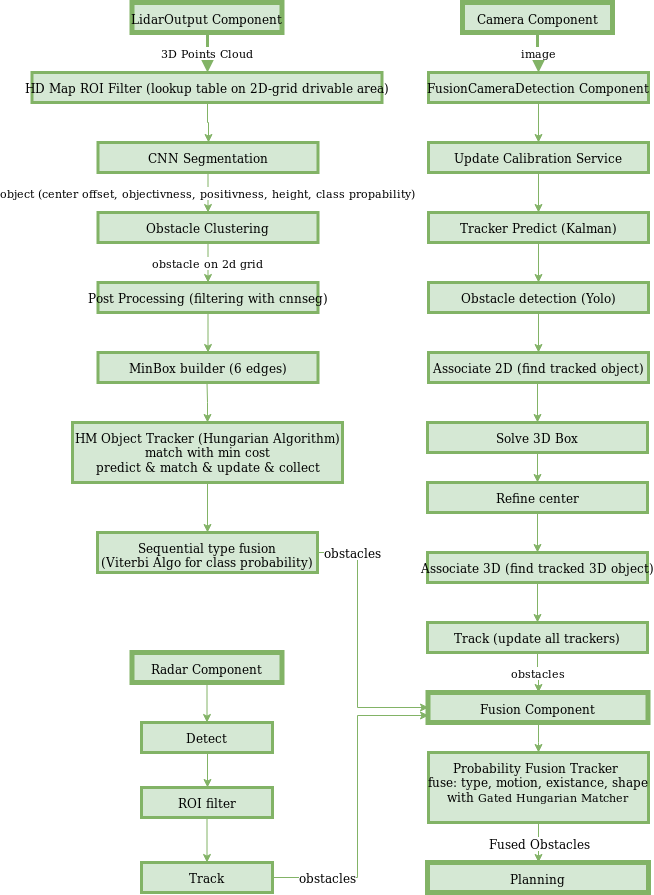

## Список актуальных задач проекта

В основе OSCAR лежит открытый проект Apollo. Софт и алгоритмика разрабатываемые в рамках этого проекта покрывают достаточно большой объем задач, которые требуется решить на пути построения беспилотника: траекторное управление, классификаторов различных объектов, модели поведения беспилотника в соответствии с дорожной ситуацией и многое другое.

Ввиду этого прежде всего стоит попробовать [собрать проект](docs/oscar/README.md) на своем ПК, исследовать и поэкспериментировать с CyberRT. Это важно, так как для интеграции большей части каких-либо разрабатываемых алгоритмов в автомобиль потребуется использовать окружение Apollo.

Задачи проекта можно разделить на две категории: **улучшение имеющегося функционала** и **разработка нового**.

#### Улучшение имеющегося функционала

Соответственно, для того, чтобы что-то улучшить, требуется как следует изучить уже имеющиеся решения. На схеме ниже представлена программная архитектура части Perception. В качестве задачи можно выбрать один или несколько блоков, разобраться в используемых алгоритмах, и попробовать что-то улучшить.

#### Разработка нового функционала

##### 1. Система управления автомобилем

1.1 Разработать алгоритм онлайн/оффлайн автонастройки пид-контроллера для управления рулем.

1.2 Разработать алгоритм автоподстройки коэффициентов контроллера управления рулем в зависимости от скоростного режима автомобиля

##### 2. Клабировка различных датчиков беспилотника

2.1 Разработать метод точного определения координат 2-х и более rdb-камер друг относительно друга и центра задней оси автомобиля.

##### 3. Онлайн оценка надежности/достоверности получаемых от сенсорики данных

3.1 Разработать алгоритма оценки згрязненности объективов камер (или защитных стекол перед объективом).

3.2 Разработать метода детекции проскальзывания колес для формирофания оценки доверия к данным с одометрии.

##### 4. Интеллектуальная обработка данных с камер

4.1 Разработать алгоритм для получения облака точек, используя одну rgb-камеру.

##### 5. Классификация и локализация объектов дорожной инфраструктуры

5.1 Разработать систему определения парковочных зон по камерам/лидару (как официальные зоны под знаком, так и места запаркованные по факту). На входе данные, на выходе информация о всех найденных парковочных зонах.

5.2 Разработать алгоритм предсказание геометрии невидимой части дороги. Решение можно базировать на базе алгоритма определения дорожной разметки в Apollo.

##### 6. Классификация и локализация участников дорожного движения

6.1 Разработать алгоритм детектирования включенных проблесковых маячков служебных автомобилей. Решение можно базировать на базе классификатора Apollo.
