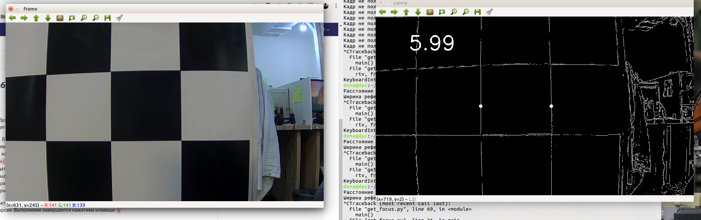

## Подготовка камер к работе с Apollo

### Калибровка

_Для проведения калибровки нужна калибровочная шахматная доска_

Устранение эффекта дисторсии осуществляется с помощью скрипта `calibrate.py`, предоставляющего следующие возможности, в зависимости от введенного ключа после запуска:
* **0** - Запись датасета для калибровки. В течение 5 секунд открывается окно с видеопотоком, шахматная доска должна полностью попадать в него в любой момент времени. В течение съемки нужно медленно менять угол между камерой и доской, желательно по всем осям. Если нужно изменить количество фотографий (по умолчанию количество сборки установлено 50), то в строке `make_photos.collect_data('camera{}/dataset'.format(cam_num))` требуется вторым параметром передать требуемое число.
* **1** - Калибровка по существующему датасету. Если есть директория с уже существующим датасетом для данной камеры, то можно указать ее, и скрипт так же выдаст параметры, использовав указанные изображения.
* **2** - Проверка калибровки. Если камера уже калибровалась и для нее есть .yaml файл, то можно просто запустить скрипт в формате двух окон, в одном из которых будет показан видеопоток без калибровки, в другом - с калибровкой.

В двух первых случаях программа создает конфигурационный Intrinsics файл c `.yaml` форматом, требуемым для Apollo. Результат выполнения - устранение эффекта дисторсии. Выполнение завершается нажатием клавиши `q`

### Измерение фокусного расстояния

Для работы программы `get_focus.py` используется приближение, что f =  c * d / w, где с - ширина CMOS матрицы в миллиметрах, w - реальная ширина объекта, полностью перекрывающего кадр по ширине, d - его ширина в пикселях. В таком случае достаточно найти две вертикальные линии, найти расстояние между ними, и расстояние от камеры до плоскости. Определяемые расстояния заностяся в соответствующий конфигурационный файл ` focus.conf` (размерность величин должны быть одинаковой), камера устанавливается перпендикулярно поверхности и запускается скрипт.

Когда две белые точки попадут на желаемые линии, в левом верхнем углу отобразится фокусное расстояние камеры в миллиметрах:

Выполнение завершается нажатием клавиши `q`.
